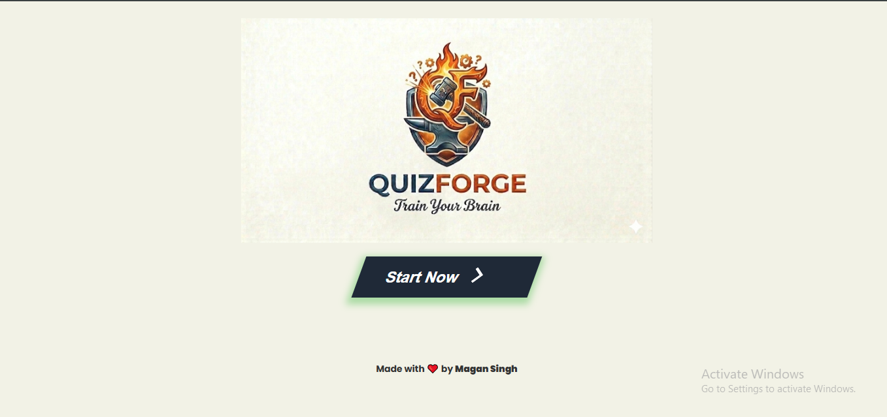
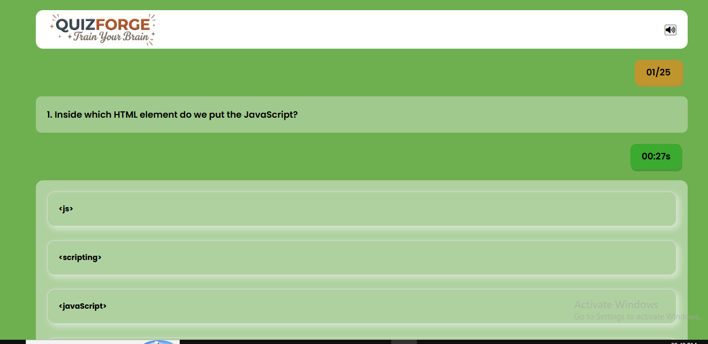
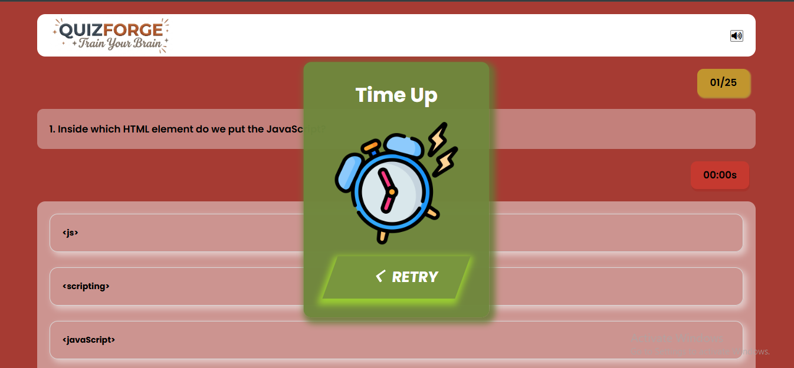
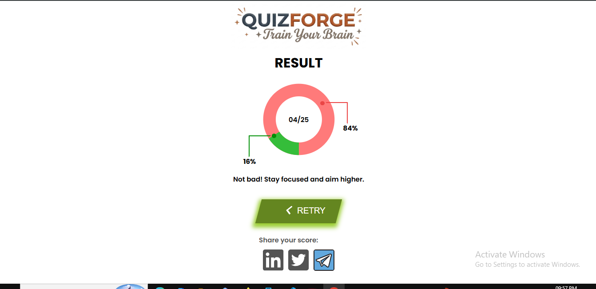

# 🧠 Quiz App

A fully responsive, interactive quiz web application with sound effects, a countdown timer, animated result display, and score sharing options. Built using **HTML**, **CSS**, and **JavaScript**.

## 🔗 Important Links

🌐 Live Site: https://quizappcircleresult.netlify.app/
💻 GitHub Profile: https://github.com/maganstackforge
📂 Project Repository: https://github.com/maganstackforge/quiz-app
👤 LinkedIn: https://linkedin.com/in/maganstackforge
📧 Email: magan.stackforge@gmail.com

---

## 🖼️ Screenshots

### 🏠 Home Page

### ❓ Quiz Page

### ⏰ Timeout Page

### 🧾 Result Page

---

## 🛠️ Features

- 25+ multiple-choice questions
- Countdown timer with ticking sound effect
- Instant audio feedback for correct and incorrect answers
- Animated circular score visualization
- Social sharing support (LinkedIn, Telegram, Twitter)
- Fully responsive design
- Retry and restart quiz functionality

---

## 📦 Tech Stack

- HTML5
- CSS3
- JavaScript (ES6+)
- Figma (for design reference)
- Git & GitHub
- Netlify (for deployment)

---

## 🧑‍💻 Author

Magan Singh

Frontend Developer Intern @ Namrata Universal

MCA Graduate | React.js | JavaScript | Tailwind CSS

---

## 📃 License

This project is open-source and free to use.

---
