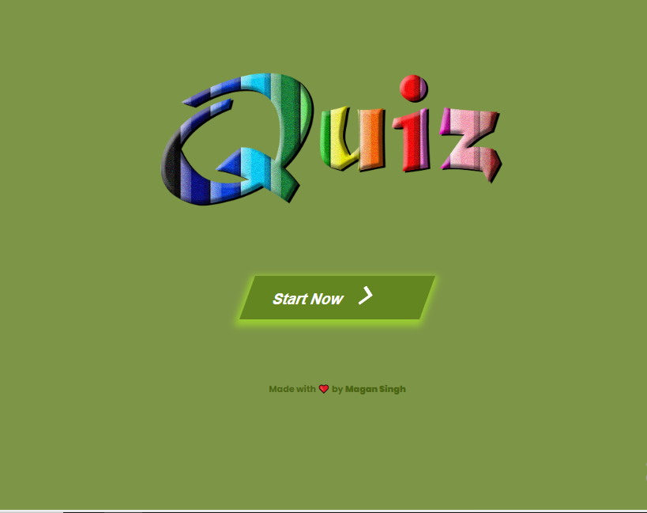
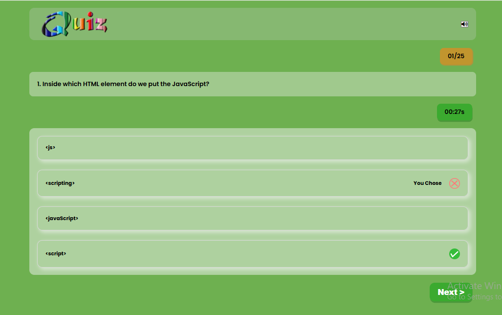
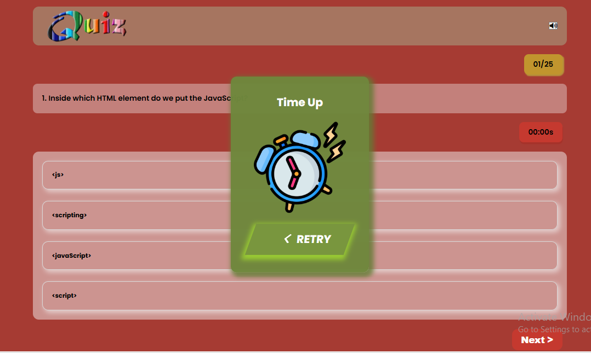
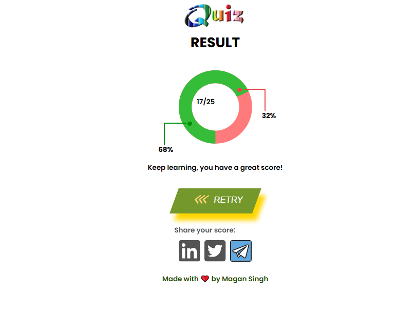

# 🧠 Quiz App

A fully responsive, interactive quiz web application with sound effects, a countdown timer, animated result display, and score sharing options. Built using **HTML**, **CSS**, and **JavaScript**.

## 📂 Folder Structure

quiz-app/
├── audiofile/
│ ├── clock-ticking.mp3
│ ├── right-music.mp3
│ └── wrong-music.mp3
├── images/
│ ├── alarm.png
│ ├── correct.svg
│ ├── favicon.png
│ ├── iconLinkedIn.svg
│ ├── iconTelegram3.svg
│ ├── iconTwitter.svg
│ ├── quiz 2.webp
│ ├── quiz1.webp
│ ├── home-page-screenshot.png
│ ├── quiz-page-screenshot.png
│ ├── quiz-timeup-screenshot.png
│ └── results-page-screenshot.png
├── circleResultPage.css
├── circleResultPage.html
├── circleResultPage.js
├── homePage.css
├── homePage.html
├── homePage.js
├── quizPage.css
├── quizPage.html
└── quizPage.js

---

## 🚀 Live Demo

🌐 [Live Website](https://your-netlify-link.netlify.app)

> Replace the link above with your actual Netlify deployment link.

---

## 🖼️ Screenshots

### 🏠 Home Page

### ❓ Quiz Page

### ⏰ Timeout Page

### 🧾 Result Page

---

## 🛠️ Features

- 25+ Multiple choice questions
- Timer with ticking sound
- Right/wrong audio feedback
- Result visualization with animated circle progress
- Score sharing on LinkedIn, Telegram, Twitter
- Responsive design for all screen sizes
- Retry quiz functionality

---

## 📦 Tech Stack

- HTML5
- CSS3
- JavaScript (ES6+)
- Figma (for design reference)
- Git & GitHub
- Netlify (for deployment)

---

## 📸 How to Add Screenshots

1. Take screenshots of:
   - Home Page
   - Quiz Page
   - Timeout (if implemented)
   - Result Page
2. Save them in the `images/` folder
3. Name them like:
   a. home-page-screenshot.png
   b. quiz-page-screenshot.png
   c. quiz-timeup-screenshot.png
   d. results-page-screenshot.png

4. Update image paths in this `README.md` if needed.

---

## 🧑‍💻 Author

**Magan Singh**  
📧 [Magan.netlify@gmail.com](mailto:Magan.netlify@gmail.com)  
🔗 [GitHub](https://github.com/Magan248)  
🔗 [LinkedIn](https://www.linkedin.com/in/magan248)

---

## 📃 License

This project is open-source and free to use.

---

